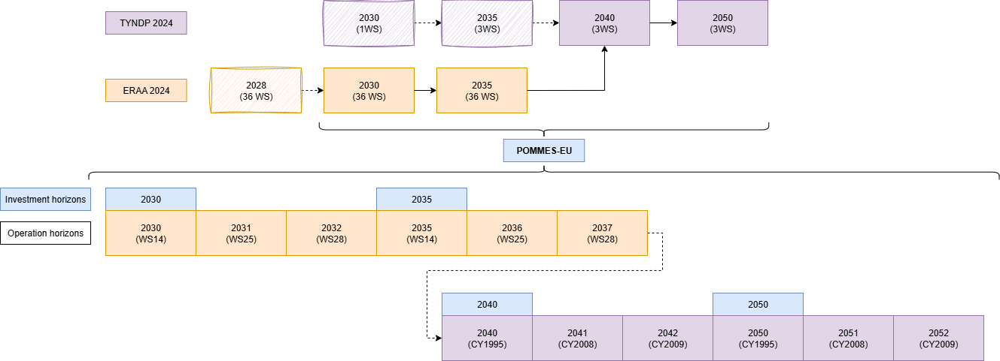

# POMMES-EU
This repository presents running code and input data for a European electricity and hydrogen model. It uses a specific version of [POMMES](https://github.com/qraillard/pommes-milp), an open source framework to model investment pathways in multi-energy systems.

The framework enables to minimise the system costs to meet the energy services demand by modelling the investment
and operating costs of energy conversion, storage and transport technologies.

POMMES-EU is based on data from [ERAA2024](https://www.entsoe.eu/eraa/2024/) and [TYNDP2024](https://www.entsoe.eu/outlooks/tyndp/2024/), integrating 35 countries (each represented by a single modeling node), four investment horizons, and three operational years—each corresponding to a distinct weather scenario—between each investment phase.

[CY=Climate Year, WS=Weather Scenario]
